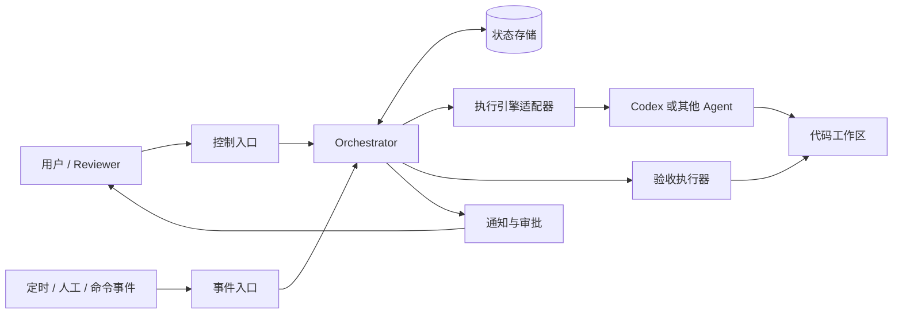
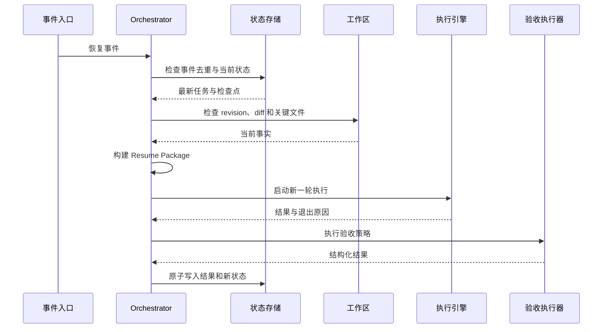

# 03 — 系统架构

## 1. 架构概览



## 2. 组件职责

### 2.1 控制入口

首版可以是命令行界面，负责：

- 创建、查看、暂停、恢复和取消任务；
- 展示等待原因和验证证据；
- 接收审批决定；
- 不直接修改任务状态，所有操作转换为事件。

### 2.2 Orchestrator

系统核心，负责：

- 验证事件；
- 根据状态机决定合法转换；
- 调用执行引擎；
- 创建检查点；
- 安排等待条件；
- 触发验收；
- 控制重试和升级。

它不负责写代码，也不解析特定 IDE UI。

### 2.3 状态存储

MVP 推荐 SQLite：

- 单机部署简单；
- 支持事务和唯一约束；
- 比散落的 JSON 文件更适合处理重复事件和并发边界；
- 后续可迁移到服务型数据库。

大型运行日志和产物可作为文件保存，数据库只存路径、摘要和校验值。

### 2.4 执行引擎适配器

对上暴露统一接口：

```text
start(run_request) -> run_handle
inspect(run_handle) -> run_status
cancel(run_handle) -> result
collect(run_handle) -> run_result
```

适配器处理不同执行引擎的启动、输入、状态和结果格式。平台不支持的能力必须显式返回 `UNSUPPORTED`，不能用脆弱的界面模拟冒充稳定接口。

### 2.5 事件入口

把外部信号规范化为统一事件：

```json
{
  "event_id": "evt_...",
  "task_id": "task_...",
  "type": "TIMER_ELAPSED",
  "occurred_at": "ISO-8601",
  "source": "scheduler",
  "payload": {},
  "dedupe_key": "..."
}
```

### 2.6 验收执行器

在限定工作目录内执行预先批准的检查，保存：

- 命令标识；
- 起止时间；
- 退出状态；
- 输出摘要；
- 完整日志位置；
- 是否为必选检查。

### 2.7 通知与审批

MVP 使用本地界面即可。未来可接入邮件、Slack 或 GitHub，但通知渠道不能成为任务状态的唯一来源。

## 3. 核心数据模型

### Task

```text
task_id
title
objective
workspace_path
state
permissions_policy
acceptance_policy
retry_policy
created_at
updated_at
version
```

### Run

```text
run_id
task_id
attempt
engine
state
input_checkpoint_id
started_at
ended_at
exit_reason
result_summary
```

### Checkpoint

```text
checkpoint_id
task_id
run_id
sequence
schema_version
workspace_revision
payload_path
payload_hash
created_at
```

### Event

```text
event_id
task_id
type
source
dedupe_key
payload
occurred_at
processed_at
outcome
```

### Approval

```text
approval_id
task_id
requested_action
risk_summary
status
requested_at
decided_at
decided_by
```

### Verification

```text
verification_id
task_id
run_id
check_name
required
status
exit_code
summary
log_path
```

## 4. 一次恢复的调用链



## 5. 一致性策略

- 状态转换使用数据库事务；
- Task 使用版本号进行乐观并发控制；
- Event 的 `dedupe_key` 建唯一索引；
- 启动外部动作前写入意图记录，完成后写入结果；
- 无法确认外部动作是否成功时进入 `NEEDS_ATTENTION`，不自动重放高风险动作；
- 检查点内容带 schema 版本和哈希，损坏时拒绝恢复。

## 6. 推荐技术形态

MVP 可采用一个本地后台进程加命令行入口：

- 数据：SQLite；
- 事件轮询：短周期调度器；
- 任务隔离：每次运行独立子进程；
- 日志：结构化 JSON Lines 加人类可读摘要；
- 配置：项目内显式配置文件；
- Agent 接入：先实现一个稳定、允许自动化调用的官方接口或 CLI 适配器。

具体语言在完成执行引擎可行性验证后再定，避免技术栈先于关键约束。

