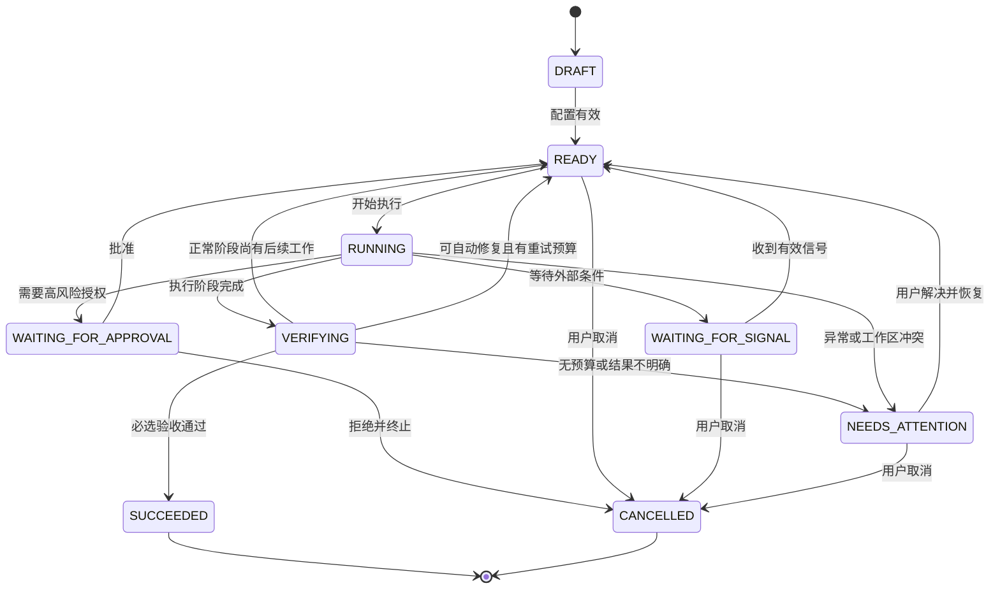

# 04 — 状态机

## 1. 状态图

## 2. 状态定义

| 状态 | 含义 | 允许自动离开 |
| --- | --- | --- |
| `DRAFT` | 任务尚未完成配置 | 否 |
| `READY` | 条件满足，可启动下一轮 | 是 |
| `RUNNING` | 执行引擎正在工作 | 是 |
| `WAITING_FOR_SIGNAL` | 等待定时、命令或外部事件 | 是 |
| `WAITING_FOR_APPROVAL` | 等待用户批准具体动作 | 否 |
| `VERIFYING` | 正在执行验收策略 | 是 |
| `NEEDS_ATTENTION` | 存在歧义、冲突或不可自动处理故障 | 否 |
| `SUCCEEDED` | 目标和必选验收全部完成 | 终态 |
| `CANCELLED` | 用户或策略终止任务 | 终态 |

## 3. 关键规则

### 3.1 `RUNNING` 不等于有进程

必须同时存在有效租约（lease）。运行进程定期续租；租约过期后，协调器检查进程与副作用状态，再决定恢复、失败或请求人工处理。

### 3.2 等待必须有原因

进入 `WAITING_FOR_SIGNAL` 时必须记录：

- 等待条件；
- 信号来源；
- 最早检查时间；
- 最晚等待时间；
- 超时动作；
- 最新检查点。

不能只保存“稍后继续”。

### 3.3 批准绑定具体动作

批准记录必须绑定动作摘要、参数哈希和有效期限。动作内容变化后，旧批准自动失效。

### 3.4 成功由策略判定

执行引擎说“完成了”只能触发 `VERIFYING`，不能直接进入 `SUCCEEDED`。

### 3.5 不确定时停止

以下情况进入 `NEEDS_ATTENTION`：

- 工作区与检查点严重冲突；
- 外部动作结果无法确认；
- 检查点损坏；
- 权限策略不允许下一步；
- 超过重试预算；
- 执行引擎输出无法解析且可能产生副作用。

## 4. 转换表

| 当前状态 | 事件 | 条件 | 下一状态 | 动作 |
| --- | --- | --- | --- | --- |
| `DRAFT` | `TASK_VALIDATED` | 配置完整 | `READY` | 保存初始检查点 |
| `READY` | `RUN_REQUESTED` | 无活动租约 | `RUNNING` | 创建 Run |
| `RUNNING` | `PHASE_COMPLETED` | 有验收策略 | `VERIFYING` | 开始验收 |
| `RUNNING` | `SIGNAL_REQUIRED` | 等待条件有效 | `WAITING_FOR_SIGNAL` | 写检查点并注册等待 |
| `RUNNING` | `APPROVAL_REQUIRED` | 动作为高风险 | `WAITING_FOR_APPROVAL` | 写审批请求 |
| `WAITING_FOR_SIGNAL` | `SIGNAL_RECEIVED` | 去重通过且条件满足 | `READY` | 标记信号已消费 |
| `WAITING_FOR_APPROVAL` | `APPROVED` | 动作哈希一致 | `READY` | 写批准范围 |
| `VERIFYING` | `CHECKS_PASSED` | 必选检查全部通过 | `SUCCEEDED` | 生成最终报告 |
| `VERIFYING` | `CONTINUATION_REQUIRED` | 当前阶段完成但任务尚有后续步骤 | `READY` | 写阶段检查点 |
| `VERIFYING` | `CHECKS_FAILED_RETRYABLE` | 必选检查失败且仍有修复预算 | `READY` | 持久化失败证据并启动修复 |
| `VERIFYING` | `CHECKS_FAILED_FINAL` | 必选检查失败且预算耗尽 | `NEEDS_ATTENTION` | 生成失败交付报告并请求人工处理 |
| 任意非终态 | `CANCEL_REQUESTED` | 用户有权限 | `CANCELLED` | 停止调度并清理租约 |

## 5. 重试策略

重试按“原因”而不是笼统次数计算：

- 临时服务不可用：指数退避并设置上限；
- 验收失败：允许有限修复轮次；
- 权限拒绝：不自动重试；
- 工作区冲突：不自动重试；
- 无法确认副作用：不自动重试。

每次重试必须创建新的 `run_id`，但沿用同一 `task_id`。
