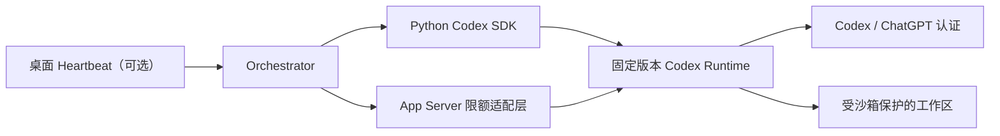

# 09 — 阶段 0 可行性报告

## 1. 结论

阶段 0 通过，可以进入阶段 1。

Codex 当前存在足够稳定的官方自动化路径来实现 MVP：

- Python SDK 可启动、继续和恢复本地 Codex thread；
- SDK 自带固定版本的 Codex CLI 运行时，不要求系统另行安装可执行 CLI；
- App Server 提供结构化 JSON-RPC 事件、thread 恢复、turn 完成状态和主动中断；
- 使用 ChatGPT 管理的认证时，App Server 可读取 Codex 限额窗口，并接收限额更新通知；
- `codex exec` 可作为一次性批处理和 CI 后备入口；
- Codex 桌面端的定时任务可作为唤醒渠道，但不替代编排器的持久状态机。

因此，MVP 不再需要通过界面自动化“猜测”额度恢复，也不需要把固定五小时定时器当成唯一恢复机制。

## 2. 推荐接入组合

职责分配：

| 需求 | 首选接口 | 说明 |
| --- | --- | --- |
| 创建任务会话 | Python SDK `thread_start` | 高层 API，减少协议耦合 |
| 执行下一轮 | SDK `thread.run` | 可设置 cwd、sandbox 和输出 schema |
| 恢复历史会话 | SDK `thread_resume` | 已通过新连接恢复实验 |
| 中断运行 | SDK `TurnHandle.interrupt` | 底层对应 `turn/interrupt` |
| 完成/失败状态 | SDK 结果与 App Server 事件 | 保留原始事件用于审计 |
| 额度窗口 | App Server `account/rateLimits/read` | 本机已验证 |
| 额度变化 | `account/rateLimits/updated` | 用于事件驱动恢复 |
| 一次性 CI 任务 | `codex exec --json` | JSONL 输出，适合批处理 |
| 定时唤醒 | 内部调度器；桌面 heartbeat 可选 | SQLite 中的事件才是状态真相 |

## 3. 能力矩阵

| 能力 | 官方支持 | 本机验证 | MVP 判断 |
| --- | --- | --- | --- |
| 非交互执行 | 是，`codex exec` | CLI 帮助可用 | 支持 |
| 机器可读输出 | 是，JSONL / JSON Schema | CLI 参数存在 | 支持 |
| 新建 thread | 是，SDK / App Server | 实际执行通过 | 支持 |
| 同连接继续 | 是 | SDK API 存在 | 支持 |
| 新连接恢复 | 是 | 实际执行通过 | 支持 |
| 主动中断 turn | 是 | SDK 与协议均存在 | 支持，阶段 1 做行为测试 |
| 完成/失败/中断状态 | 是 | 协议和类型存在 | 支持 |
| ChatGPT 限额读取 | 是 | 实际返回限额数据 | 支持 |
| 限额更新时间 | 是，`resetsAt` | 字段实际存在 | 支持 |
| 限额变化通知 | 是 | 协议和类型存在 | 支持，阶段 1 做长连测试 |
| Token 活动摘要 | 是，认证类型受限 | 未读取 | 非 MVP 必需 |
| 高风险审批 | 是，App Server 请求事件 | 文档确认 | 编排器仍需自己的审批策略 |
| 桌面定时唤醒 | 是 | 当前环境暴露 automation 能力 | 可选适配器 |
| 系统桌面应用直接当 CLI | 不保证 | WindowsApps 入口拒绝执行 | 不采用 |
| WebSocket 远程控制 | 实验性且有限制 | 未测试 | MVP 不采用 |

## 4. 官方能力证据

### 4.1 App Server

[Codex App Server 官方文档](https://learn.chatgpt.com/docs/app-server)描述了：

- 基于 JSON-RPC 2.0 的双向协议；
- `thread/start`、`thread/resume` 和 `turn/start`；
- `turn/completed` 的 completed、interrupted、failed 状态；
- `turn/interrupt` 主动取消；
- `account/rateLimits/read` 和 `account/rateLimits/updated`；
- stdio JSONL 作为默认传输。

WebSocket 传输在当前文档中仍标记为实验性和不受支持，因此 MVP 使用本地 stdio。

### 4.2 Python SDK

[Codex SDK 官方文档](https://learn.chatgpt.com/docs/codex-sdk)说明 Python SDK：

- 控制本地 App Server；
- 支持 Python 3.10+；
- 发布包带固定版本 Codex CLI 运行时；
- 支持 thread 创建、继续和恢复；
- 支持 read-only、workspace-write 和 full-access 沙箱。

### 4.3 非交互模式

[Codex 非交互模式文档](https://learn.chatgpt.com/docs/non-interactive-mode)说明 `codex exec`：

- 可用于 CI、计划任务和脚本；
- `--json` 输出 JSONL 事件；
- `--output-schema` 约束最终结构；
- `exec resume` 可恢复历史 session；
- 默认 read-only，写入权限需显式打开。

### 4.4 桌面计划任务

[Codex Scheduled tasks 文档](https://learn.chatgpt.com/docs/automations)说明桌面端可：

- 在现有 chat 内按计划继续；
- 对本地项目运行后台任务；
- 使用本地目录或隔离 worktree；
- 以默认沙箱无人值守执行。

这适合做唤醒和提醒，但其运行历史不替代 Orchestrator 的事件去重、检查点和验收记录。

## 5. 限额监控结论

阶段 0 前的保守假设是“可能不存在稳定额度接口”。该假设已被部分推翻。

在本机 ChatGPT 认证下：

- `account/rateLimits/read` 调用成功；
- 返回 `rateLimits`；
- primary bucket 含 `usedPercent`；
- primary bucket 含 `resetsAt`。

推荐恢复算法：

1. 启动时调用 `account/rateLimits/read`；
2. 正常运行时监听 `account/rateLimits/updated`；
3. 遇到限额错误时保存检查点；
4. 以 `resetsAt` 安排一次带随机抖动的回查；
5. 到时重新读取，而不是直接假定额度恢复；
6. 数据缺失时退化为低频指数退避；
7. 始终保留人工恢复事件。

边界：

- 这些方法描述的是 ChatGPT 管理的限额，不等同于 Platform API 配额；
- 返回内容可能因计划、工作区和认证模式不同而变化；
- `resetsAt` 是下一窗口重置时间，不保证所有阻塞原因届时消失；
- 不能把“读取成功”解释为允许规避产品限制。

## 6. 可行性风险

### R1：App Server 命令仍带实验性标签

缓解：

- 固定 SDK 与 CLI 版本；
- 每个版本生成 JSON Schema；
- 只使用文档化且不要求 `experimentalApi` 的方法；
- 在升级前运行协议契约测试。

### R2：高层 SDK 未覆盖全部账户方法

当前本机 SDK 0.144.4 暴露 thread 生命周期和中断，但未在高层 API 中直接暴露 `account/rateLimits/read`。

缓解：

- 用一个极薄的 App Server JSON-RPC 客户端读取限额；
- 不访问 SDK 私有成员；
- 把限额观察封装为可替换接口。

### R3：本机桌面应用入口不可作为普通 CLI

WindowsApps 中的桌面应用 `codex.exe` 可被系统发现，但作为普通子进程执行时返回 `Access is denied`。

缓解：

- 使用 SDK 自带的固定版本 CLI；
- 不依赖桌面应用安装路径；
- 在安装检测中把 Desktop、CLI 和 SDK Runtime 分开判断。

### R4：认证类型决定额度语义

API key 自动化与 ChatGPT 管理认证的计费和限额来源不同。

缓解：

- 检查 `account/read` 的认证类型；
- 对不同认证类型使用不同的 RateLimitProvider；
- 不混用 ChatGPT `resetsAt` 与 API 重试策略。

## 7. 阶段 0 退出评估

| 退出标准 | 结果 |
| --- | --- |
| 选定接入方式 | 通过 |
| 明确支持与不支持能力 | 通过 |
| 完成新连接恢复实验 | 通过 |
| 确定限额触发策略 | 通过 |
| 无关键阻塞项 | 通过 |

建议立即进入阶段 1，但先只实现协议适配、状态存储和假执行器，不直接做完整自主开发循环。
