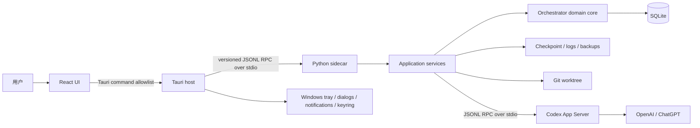

# 阶段七：产品定义与桌面架构

状态：已完成

## 1. 目标

阶段七把现有命令行编排内核收敛为可实施、可测试的 Windows 桌面产品设计。
本阶段只确定产品体验、进程边界、安全契约和安装契约；真实 Codex 执行主链在
阶段八实现，完整界面在阶段九实现。

## 2. 已批准决定

### D7-01 桌面技术栈

- Windows 桌面外壳：Tauri 2。
- 用户界面：React + TypeScript。
- 编排后台：保留现有 Python 内核，打包为独立 sidecar。
- 桌面外壳负责窗口、托盘、单实例、文件夹选择和本地通知。
- React 不直接访问 SQLite、凭据或操作系统敏感能力。
- 所有领域状态变化继续通过 Python 应用服务和状态机完成。

本决定的理由和后果记录在
`docs/adr/0001-use-tauri-react-and-a-python-sidecar.md`。

### D7-02 窗口关闭与后台运行

- 点击主窗口关闭按钮只隐藏到 Windows 系统托盘，不中断活动 Task。
- 托盘菜单提供打开窗口、查看状态、暂停或恢复以及退出。
- 只有显式选择“退出应用”才停止 Python sidecar。
- 活动 Task 存在时，退出流程必须先安全暂停并写入有效 Checkpoint。
- v1.0 不安装 Windows Service；托盘应用是后台进程的生命周期所有者。
- 登录后启动是默认关闭的可选项；未启用时，电脑重启后由用户手动启动并恢复。
- 首次发生“关闭到托盘”时显示一次明确说明，避免用户误认为应用已经退出。

本决定的理由和后果记录在
`docs/adr/0002-use-the-tray-application-as-process-owner.md`。

### D7-03 桌面外壳与 Python sidecar 通信

- Tauri 启动并监管 Python sidecar。
- 双方通过带版本号、按行分帧的 JSON RPC 在标准输入和标准输出通信。
- 桌面产品默认不监听 HTTP 或 WebSocket 端口。
- React 只能调用 Tauri 暴露的命令白名单，不能直接连接 sidecar。
- 标准输出只承载协议消息；诊断信息进入标准错误和经过脱敏的日志文件。
- 启动时校验协议版本；限制单条消息大小、队列长度和并发请求数。
- 格式错误或未经请求的特权消息视为 sidecar 故障，不执行其携带的动作。
- 现有 HTTP 与 Webhook 入口不随 v1.0 桌面应用启动。

本决定的理由和后果记录在
`docs/adr/0003-use-private-stdio-rpc-for-the-sidecar.md`。

### D7-04 Codex 登录与凭据

- 使用 Codex App Server 的稳定账户接口，不自建 OAuth 或令牌刷新系统。
- 首选 ChatGPT 浏览器登录，并提供设备代码回退。
- 同时提供 API Key 登录，供按 API 用量付费的用户选择。
- Codex 负责凭据持久化、刷新和退出。
- Windows 上强制配置 `cli_auth_credentials_store = "keyring"`。
- Windows 安全凭据存储不可用时明确报错，不降级为明文 `auth.json`。
- UI 只显示 App Server 返回的非敏感账户摘要。
- React、Tauri 和 Python 编排器均不得保存、记录或备份原始凭据。
- 不使用实验性的外部 ChatGPT Token 托管模式。

本决定的理由和后果记录在
`docs/adr/0004-let-codex-own-authentication-and-credentials.md`。

### D7-05 Windows 目录布局

应用必须通过 Windows Known Folder API 解析路径。以下环境变量写法仅用于说明：

| 内容 | 默认位置 |
| --- | --- |
| 程序文件 | `%LOCALAPPDATA%\Programs\AI Agent Orchestrator\` |
| 数据库、Checkpoint、配置和产物索引 | `%LOCALAPPDATA%\AI Agent Orchestrator\data\` |
| 脱敏运行日志 | `%LOCALAPPDATA%\AI Agent Orchestrator\logs\` |
| Task 隔离 Worktree | `%LOCALAPPDATA%\AI Agent Orchestrator\worktrees\` |
| 用户可见备份 | `%USERPROFILE%\Documents\AI Agent Orchestrator Backups\` |

约束：

- 采用每用户安装，默认不请求管理员权限。
- 升级或修复只替换程序文件，并运行显式的向前 Schema 迁移。
- 卸载默认保留数据、日志、Worktree 和备份。
- 只有用户单独明确选择“同时删除本地数据”时才删除用户数据。
- 用户可以在设置中更改备份目录。
- 凭据不属于以上任何目录，也不进入备份。

本决定的理由和后果记录在
`docs/adr/0005-separate-per-user-program-data-and-backups.md`。

### D7-06 Git Worktree 生命周期

- 每个 Task 从一个明确的已提交 revision 创建独立分支和 Worktree。
- 分支使用 `aiao/task-<任务短 ID>` 命名，并与 Task 一一绑定。
- Agent 永远不直接修改用户选择仓库的原始工作目录。
- 原工作目录存在未提交修改时，应用不 stash、不复制、不静默纳入；用户必须确认
  Task 将从已提交 revision 开始。
- 自动提交必须取得绑定精确提交动作的 Approval。
- v1.0 不自动合并，也不自动推送远程仓库。
- 成功、失败或取消后默认保留分支和 Worktree。
- 只有 Task 已结束且 Worktree 干净时，用户才能明确执行清理。
- Worktree 丢失、被移动、损坏、包含未提交修改或状态不确定时进入
  `NEEDS_ATTENTION`，正常流程不得强制删除。

本决定的理由和后果记录在
`docs/adr/0006-isolate-each-task-in-a-retained-git-worktree.md`。

### D7-07 安装、升级、卸载与迁移

- v1.0 发布一个 Tauri NSIS `Setup.exe`，目标为 x64 Windows 10 22H2 和
  Windows 11。
- 采用每用户安装，不要求管理员权限。
- Python、Codex 运行组件及其他运行依赖随产品打包。
- 安装包内置 WebView2 Evergreen bootstrapper；仅在系统缺少 WebView2 时联网安装。
- v1.0 不制作完全离线 WebView2 包。
- 手动升级复用稳定的安装器 App ID。
- 替换程序文件或迁移数据库前，必须创建并验证本地备份。
- Schema 只允许向前迁移；迁移失败不得启动半迁移数据库，并保留可恢复的旧版本和备份。
- 禁止旧版本打开不兼容的新 Schema。
- 卸载默认保留用户数据，删除数据必须使用独立的显式选项。
- MSI、ARM64 和完全离线安装包延期到 v1.x 评估。

本决定的理由和后果记录在
`docs/adr/0007-ship-a-per-user-x64-nsis-installer.md`。

### D7-08 UI 信息架构

- 首次使用向导：环境检查、Codex 登录、数据位置和登录后启动。
- 首页：当前任务、下一步、等待原因、待审批和最近任务。
- 新建任务向导：仓库、目标、权限、验收与重试预算、最终确认。
- 任务详情：概览、实时进度、运行记录、变更、Checkpoint、验收证据和报告。
- 审批中心：统一显示待审批动作，并在任务上下文中提供入口。
- 设置与维护：账户、启动、通知、备份恢复、日志、诊断、版本和数据位置。
- 普通界面使用用户语言解释状态；内部状态名只出现在展开的技术详情中。
- 危险动作必须进入正式 Approval 流程，普通确认框不能替代。

用户流程、线框和验收场景见
`25-stage-7-user-experience-spec.md`。

## 4. 不可突破的现有边界

- UI 不直接写 SQLite。
- 持久化任务状态只通过 `OrchestratorService.process_event` 改变。
- 所有已应用或被拒绝的状态变更都进入审计日志。
- 凭据、令牌和原始认证记录不得进入 SQLite、Checkpoint、日志或测试输出。
- 高风险 Side Effect 必须具有绑定精确动作哈希且未过期的 Approval。
- 不确定的 Side Effect 不得自动重放。
- v1.0 不监听公网端口，不创建云资源，不收集遥测。

## 5. 目标进程架构

### 5.1 所有权

| 组件 | 拥有 | 不得拥有 |
| --- | --- | --- |
| React | 展示状态、表单草稿、无敏感 UI 偏好 | SQLite、凭据、Git、进程 |
| Tauri | 单实例、窗口、托盘、系统能力、sidecar 生命周期 | 领域状态转换、验收结论 |
| Python sidecar | 应用服务、任务调度、读模型、恢复、备份协调 | Codex 原始凭据 |
| Domain core | 状态机、幂等、审批、审计、验收规则 | UI 和平台特定逻辑 |
| Codex App Server | Codex 会话、登录、凭据刷新、Agent 事件 | Orchestrator Task 状态 |
| SQLite | Task、Run、Event、Approval、审计和证据索引 | 原始日志、凭据、认证记录 |

### 5.2 进程生命周期

1. Tauri 获得单实例锁并解析 Windows Known Folders。
2. Tauri 启动 Python sidecar，限制继承环境，并分别连接协议流和诊断流。
3. 双方完成协议版本、产品版本、Schema 兼容性和能力握手。
4. Python 打开数据库，执行完整性检查，恢复过期租约并发布只读启动快照。
5. 需要 Codex 时，Python 以 stdio 启动固定版本 App Server 并完成初始化。
6. React 只有在启动快照就绪后进入首页；否则进入可恢复的诊断页面。
7. 关闭窗口只隐藏到托盘。显式退出时，活动 Run 先中断、落 Checkpoint、
   释放租约，再关闭 App Server、Python sidecar 和 Tauri。
8. sidecar 意外退出时，Tauri 最多自动重启一次；重复失败停止自动重启并显示诊断，
   不在未知状态下继续执行。

## 6. Sidecar 协议契约

协议名称暂定 `aiao.desktop.v1`，使用 UTF-8 JSONL。每条消息必须小于 1 MiB，
请求必须包含 `id`、`method` 和对象型 `params`，响应必须包含相同 `id` 以及
`result` 或 `error`。事件没有 `id`，但包含单调递增的 `sequence`。

首批方法：

| 方法 | 用途 | 是否可能改变状态 |
| --- | --- | --- |
| `system/initialize` | 协议、版本、路径和能力握手 | 否 |
| `system/status` | 读取健康、Schema 和依赖状态 | 否 |
| `account/read` | 读取脱敏 Codex 登录摘要 | 否 |
| `account/login/start` | 启动 Codex 托管登录 | 是，非领域状态 |
| `account/logout` | 清除 Codex 登录 | 是，非领域状态 |
| `task/list`、`task/read` | 查询 UI 读模型 | 否 |
| `task/create` | 创建 Draft 和 Worktree | 是 |
| `task/start` | 校验并分派 Ready Task | 是 |
| `task/pause`、`task/resume` | 安全暂停或恢复 | 是 |
| `task/cancel` | 中断、Checkpoint 并取消 | 是 |
| `approval/list`、`approval/decide` | 查询或决定精确 Approval | 决定会改变状态 |
| `backup/create`、`backup/restore` | 创建或恢复验证后的备份 | 是 |
| `diagnostics/export` | 生成脱敏诊断包 | 否 |

改变 Task 状态的方法必须携带 `expectedVersion` 和调用方生成的
`idempotencyKey`。sidecar 把意图转换为应用服务调用；任何接口都不能直接执行
SQL 状态更新。

长日志、Diff 和报告不放入无界事件。协议发送分页摘要或一次性只读文件句柄，
Tauri 验证句柄位于批准的数据目录后读取。React 刷新后通过 `task/read` 重建状态，
不能依赖内存事件成为真相源。

## 7. 阶段八必须补齐的应用服务

当前内核已有状态机、执行协调器、Checkpoint、Verification、Approval 和持久层，
但 CLI 仍承担了部分编排。桌面 UI 不得复用 CLI 参数解析器，阶段八需要新增：

| 服务 | 职责 |
| --- | --- |
| `DesktopQueryService` | 为首页、任务、审批和诊断提供脱敏分页读模型 |
| `TaskLifecycleService` | 创建、校验、启动、暂停、恢复、取消与单活动 Task 互斥 |
| `CodexSessionService` | App Server 启动、登录状态、线程和 Turn 生命周期 |
| `WorktreeService` | 仓库预检、分支与 Worktree 创建、漂移校验和安全清理 |
| `BackupService` | 在线一致性备份、校验、恢复前快照和恢复 |
| `SettingsService` | 非敏感设置、Known Folder 路径和登录启动开关 |
| `DesktopRpcServer` | 方法白名单、Schema 校验、幂等、限流和错误映射 |

领域缺口：

- 增加明确的 `PAUSED` 状态和暂停/恢复事件，不能把用户暂停伪装成外部信号等待。
- 运行中的取消必须先中断 Codex、记录最终 Checkpoint，再提交取消事件。
- 单活动 Task 必须由数据库约束或同等强度的事务互斥保证。
- Worktree 与 Task 的绑定、基准 revision、分支和清理状态必须持久化。
- UI 读模型必须稳定分页，且所有路径、日志和错误在返回前经过脱敏。

这些变更触及 Schema 或状态机时，必须遵守 `AGENTS.md` 的向前迁移、重启测试和
状态机测试要求。

## 8. 安全分析

| 威胁 | 控制 |
| --- | --- |
| 恶意网页调用本地服务 | 桌面主链无监听端口，React 仅能调用 Tauri allowlist |
| 被替换的 sidecar | 安装产物清单和启动前哈希校验；协议版本握手 |
| 协议注入或资源耗尽 | 严格 JSON Schema、1 MiB 上限、有界队列、请求超时 |
| UI 绕过状态机 | 所有写操作进入应用服务并最终调用领域服务 |
| 凭据泄漏 | Codex 托管登录、Windows keyring、全链路脱敏、备份排除 |
| 路径穿越 | 使用规范化绝对路径，并限制产物句柄位于批准根目录 |
| 原仓库被修改 | Agent 只获得 Task Worktree，原目录不作为执行 cwd |
| 旧 Approval 被复用 | 动作哈希、版本、有效期和一次性消费 |
| 崩溃后重复外部动作 | Side Effect ledger；`PENDING/UNKNOWN` 不自动重放 |
| 升级破坏数据 | 迁移前验证备份、前向迁移、兼容性门禁、失败即停止 |

## 9. 架构评审结论

评审日期：2026-07-30

- [x] 完整用户流程无需终端。
- [x] 每个 UI 写动作映射到现有领域能力或一个明确的新应用服务。
- [x] UI 不直接访问 SQLite、凭据、Git 或 Codex 进程。
- [x] Task 状态、Approval、Side Effect ledger 和脱敏边界保持有效。
- [x] 桌面主链不开放本地或公网端口。
- [x] 窗口关闭、显式退出、sidecar 崩溃和电脑重启均有确定语义。
- [x] 已选定 Tauri、React、Python sidecar 和 NSIS 打包方案。
- [x] 安装、升级、卸载、备份和 Schema 迁移契约已定义。
- [x] Worktree 生命周期不会自动合并、推送或删除用户更改。
- [x] 阶段八的领域与应用服务缺口已列出。
- [x] UI 验收场景可直接转化为阶段九端到端测试。

结论：阶段七通过架构评审，可以进入阶段八“真实 Codex 执行主链”。
