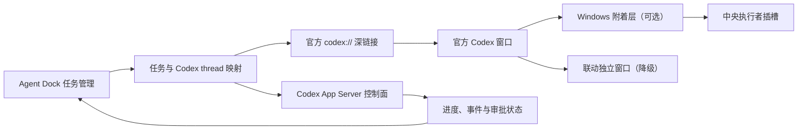

# 真实 Codex 窗口附着可行性报告

## 结论

真实窗口附着在当前 Windows 11 与当前官方 Codex 客户端上已经完成最小
验证，可以进入用户体验原型阶段。

这项结论只表示“当前客户端窗口能够被 Windows 宿主暂时承载”，不表示
OpenAI 官方承诺第三方应用可以永久嵌入 Codex。产品必须同时保留官方深链接
和独立窗口联动方案。

## 产品边界

中央区域显示的必须是官方 Codex 客户端本身：

- 窗口来自已安装的官方 `ChatGPT.exe`；
- Codex 自己渲染账号、任务、对话、输入框和执行结果；
- Agent Dock 只管理外部工作台、任务选择、消息队列和窗口位置；
- 不制作仿 Codex 的聊天界面，不复制身份信息，不接管认证；
- 附着不可用时，打开同一个官方 Codex 任务作为联动窗口。

## 官方支持能力

当前官方资料明确支持：

- `codex://threads/<thread-id>` 打开已有本地任务；
- `codex://threads/new` 或 `codex://new` 创建本地任务；
- 新任务深链接可以携带绝对工作目录和预填提示词；
- 预填提示词不会被静默发送，仍由用户确认；
- Codex App Server 通过本地 stdio 提供 thread、turn 和流式事件协议。

官方资料没有提供“把 Codex 桌面窗口嵌入第三方窗口”的公开接口。因此，
原生附着属于 Windows 兼容层，而不是 Codex 协议层。

## 本机验证结果

测试环境：

- Windows 11，x64；
- 官方商店版 Codex/ChatGPT 客户端；
- 可见窗口进程为 `ChatGPT.exe`；
- 窗口类为 `Chrome_WidgetWin_1`。

| 检查 | 结果 | 说明 |
| --- | --- | --- |
| 发现官方窗口 | 通过 | 找到一个可见官方顶层窗口 |
| 附着到宿主区域 | 通过 | 真实窗口句柄被放入测试插槽 |
| 跟随宿主尺寸 | 通过 | 附着后按宿主客户区调整 |
| 正常脱离 | 通过 | 恢复原父窗口、样式和位置 |
| 官方进程身份校验 | 通过 | 限定为 WindowsApps 中的 `OpenAI.Codex` 包 |
| 原生拖动事件监听 | 通过 | 已注册指定 Codex 进程的 WinEvent 监听 |
| 磁吸距离与滞回 | 已实现 | 48px 进入、80px 退出，停留 150ms 后生效 |
| 点击穿透预览层 | 已实现 | 预览不获取键盘和鼠标焦点 |
| 松手自动附着 | 待用户实测 | 自动化规则禁止控制 Codex 客户端拖动 |
| 拖动把手脱离 | 待用户实测 | 脱离后恢复官方窗口原生移动 |
| 异常退出恢复记录 | 已实现 | 下次启动校验进程和窗口后恢复 |
| 任务或内容被修改 | 未发生 | 测试不发送提示词、不操作任务 |
| 多窗口选择 | 待验证 | 当前只选择面积最大的官方窗口 |
| Codex 更新兼容性 | 待验证 | 官方窗口实现可能随版本改变 |
| 非正常崩溃恢复 | 待验证 | 生产版需要独立恢复守护 |
| 任务与 thread 精确绑定 | 待验证 | 需要结合深链接和弹出任务窗口 |

## 推荐架构

这里有两个不能混淆的层面：

- Codex 协议层负责找到或继续正确任务；
- Windows 附着层只负责把官方窗口放到正确位置。

附着失败不能导致任务无法使用。

## 原型

`spikes/codex-window-docking` 是独立的开发验证程序，包含：

- 只读窗口探测；
- “附着真实 Codex 窗口”；
- “安全脱离”；
- 使用官方深链接打开新 Codex 任务；
- 窗口关闭时自动恢复 Codex。

它不是新客户端，也不会绘制 Codex 对话。

## 进入产品实现前的验收门槛

1. 使用 Codex 的独立任务弹出窗口，而不是长期占用整个主窗口。
2. 验证任务 A、任务 B 能通过 thread ID 精确切换。
3. 验证中文输入法、复制粘贴、快捷键、焦点和弹窗。
4. 验证 100%、150%、200% 缩放以及跨显示器移动。
5. 验证 Codex 重启、升级、崩溃和 Agent Dock 崩溃后的恢复。
6. 验证管理员权限不一致时自动降级为联动窗口。
7. 确保用户始终能一键脱离，并且不会丢失 Codex 任务。

满足这些条件后，才把附着能力接入 Tauri 正式桌面应用。
